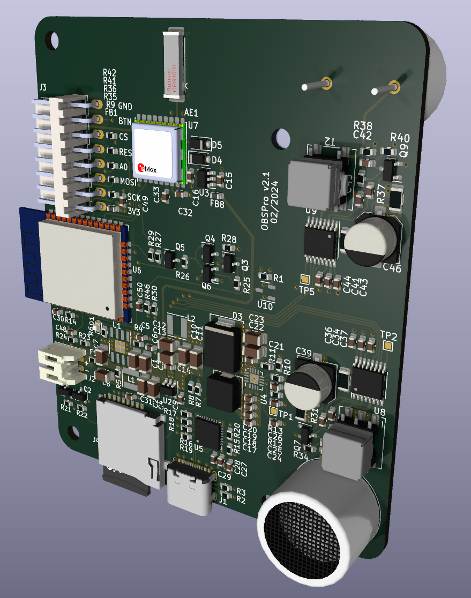

# OBSPro
This is a different version of the OpenBikeSensor main PCB (checkout https://github.com/openbikesensor/OpenBikeSensor_PCB_Board) with a few design goals:
* Optimized for pick-and-place manufacturing. This means no modules for each functionality, everything is on a single board and SMD parts are used.
* Parts only from trustworthy and reliable sources. This also includes that it should be possible to order these parts with a proper bill.
* Software compatibility as far as possible with the original hardware/software.

# PCBA
At the moment I am aiming to get almost all parts from LCSC/JLCPCB, which are a good mixture of trustworthiness/reliability and price. JLC also offers a PCB assemby service, which I am planing to use. If you only want up to 10 boards, it is probably not woth it, but for larger orders I would love it.

# GPS
There are multiple option for the GPS module. You can use any MAX-8* or MAX-10* from u-blox, which cost around 20€ for single quantities. The pinout is also compatible with the ATGM336H-5N* modules from Zhongkewei. It costs only around 5€, but the performance still needs to be evaluated.

# Current preview
Here is an image of the current board. The parts are roughly placed and basically nothing is routed. Also there are a bunch of 3D models still missing.

