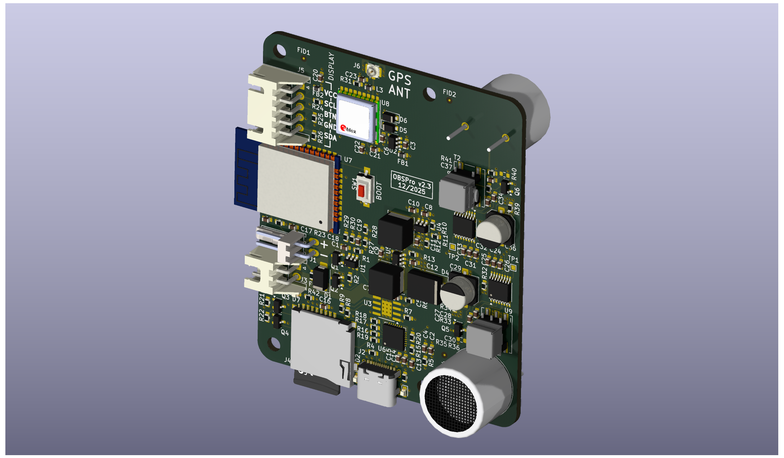

# OBSPro
This is a different version of the OpenBikeSensor main PCB (checkout https://github.com/openbikesensor/OpenBikeSensor_PCB_Board) with a few design goals:
* Optimized for pick-and-place manufacturing. This means no modules for each functionality, everything is on a single board and SMD parts are used.
* Parts only from trustworthy and reliable sources. This also includes that it should be possible to order these parts with a proper bill.
* Software compatibility as far as possible with the original hardware/software.

# PCBA
At the moment we are aiming to get almost all parts from LCSC/JLCPCB, which is a good mixture of trustworthiness/reliability and price. JLC also offers a PCB assemby service, which is used. If you only want one or two boards, it is probably not woth it, but for larger orders it makes perfect sense.

# GPS
There are multiple options for the GPS module. You can use any MAX-8* or MAX-10* from u-blox, which cost around 20€ for single quantities. The pinout is also compatible with the ATGM336H-5N* modules from Zhongkewei. It only costs around 5€, but the performance still needs to be evaluated.

# BOM
Here is a list of parts and potential sources you will need besides the parts listed in the BOM file of the PCB itself.

- THT PCB parts
    - These are also included in the PCB BOM, but not populated by us in the kit.
    - 1x display jack:
        - JST-  S5B-XH-A(LF)(SN): [LCSC](https://www.lcsc.com/product-detail/C263757.html)
    - 1x power switch jack:
        - JST - S2B-XH-A(LF)(SN): [LCSC](https://www.lcsc.com/product-detail/C157931.html)
    - 1x battery jack:
        - XKB Connection - X2510WR-02-N0SN: [LCSC](https://www.lcsc.com/product-detail/C843326.html)
    - 2x ultrasonic transducer
        - HYDZ: HY40A16T12-1: [LCSC](https://www.lcsc.com/product-detail/C17701106.html)
- GPS antenna
    - BAT WIRELESS - BWGNSCNX25-25B1Y2L120: [LCSC](https://www.lcsc.com/product-detail/C784385.html)
- Battery
    - Probably any 18650 style Lipo battery will do. As you need to solder the connectors to the battery, one with U-shaped strips already attached is recommended.
    - Samsung - INR18650-20R [akkuteile.de](https://www.akkuteile.de/lithium-ionen-akkus/18650/samsung/samsung-inr18650-20r-2000mah-3-7v-10c-20a-powertoolzelle-u-loetfahne_1006511_1668)
    - Multiple: [akkuservice-krueger.de](https://www.akkuservice-krueger.de/epages/64221289.sf/de_DE/?ObjectID=15698141&ViewAction=ViewFaceted&FacetValue_CategoryID=15698141&FacetValue_PreDefString_de_2010346554=L%C3%B6tfahne+U-Form&CurrencyID=EUR&FacetRange_ListPrice=&FacetRange_ListPrice=) (you can select with solder strip for each battery)
- Battery cable + connector + crimp contacts
    - 1x complete assembly: XKB Connection - X2510T-02-PSN-A22RB-L300-T5: [LCSC](https://www.lcsc.com/product-detail/C7423671.html) (if you buy this, you do not need the parts below)
    - 1x connector: XKB Connection - X2510H-02-N0: [LCSC](https://www.lcsc.com/product-detail/C843320.html)
    - 2x crimp contacts: XKB Connection - X2510T-PSN: [LCSC](https://www.lcsc.com/product-detail/C883292.html)
    - 2x cable (use any ~0.25mm² cable you can find, same for power switch connector)
- 2x zip ties
    - Maximum width: 4.5 mm, minimum length: 70 mm.
    - [LCSC](https://www.lcsc.com/product-detail/C5264191.html), [LCSC](https://www.lcsc.com/product-detail/C4944856.html), [LCSC](https://www.lcsc.com/product-detail/C5197740.html), your local hardware store, ...
- 1x Power switch
    - YUEN FUNG - MT-0-102-A101-M200-RS: [LCSC](https://www.lcsc.com/product-detail/C1788492.html)
- Power switch cable + connector + crimp contacts
    - 1x complete assembly: SHOU HAN - 2.54-2P DT 200mm 24AWG: [LCSC](https://www.lcsc.com/product-detail/C5363463.html) (if you buy this, you do not need the parts below)
    - 1x connector: JST - XHP-2: [LCSC](https://www.lcsc.com/product-detail/C144401.html)
    - 2x crimp contacts: JST - SXH-001T-P0.6: [LCSC](https://www.lcsc.com/product-detail/C140573.html?s_z=n_C140573) (same for the display connector!)
    - 2x cable (use any ~0.25mm² cable you can find, same for battery connector)
- 1x SD card
    - MK - MKUS128M-IGT1: [LCSC](https://www.lcsc.com/product-detail/C22374947.html)
    - SDTRUVAL - SDSDQAB-128M-SDWHA: [LCSC](https://www.lcsc.com/product-detail/C51885978.html)
- 8x Threaded insert nuts M3, ~5mm length, ~4.2mm outer diameter
    - Multiple: [Aliexpress](https://de.aliexpress.com/item/1005003453080262.html)
- 14x M3x8 screws (DIN912)
    - Used for: 4x main housing, 4x PCB, 3x display housing, 2x display cable strain relive, 4x main housing mounting.
    - Multiple: [Gedex](https://www.gedex-shop.de/de/schrauben/INNENSECHKANT/Zylinderkopf-DIN-912/DIN-912-M3-Innensechskantschrauben-mit-Zylinderkopf-Edelstahl-rostfrei-A2/DIN-912-M3-Innensechskantschrauben-mit-Zylinderkopf-Edelstahl-rostfrei-A2-637/), [LCSC](https://www.lcsc.com/product-detail/C5138485.html), [LCSC](https://www.lcsc.com/product-detail/C7576553.html), [LCSC](https://www.lcsc.com/product-detail/C2931407.html)
- 1x M3x30 screw (DIN912)
    - Used for the locking pin.
    - Multiple: [Gedex](https://www.gedex-shop.de/de/schrauben/INNENSECHKANT/Zylinderkopf-DIN-912/DIN-912-M3-Innensechskantschrauben-mit-Zylinderkopf-Edelstahl-rostfrei-A2/DIN-912-M3-Innensechskantschrauben-mit-Zylinderkopf-Edelstahl-rostfrei-A2-644/), [LCSC](https://www.lcsc.com/product-detail/C7576562.html)
- 6x M3 nuts (DIN934)
    - Used for: 4x main housing mount, 2x cable strain relief for display unit.
    - Multiple: [Gedex](https://www.gedex-shop.de/de/MUTTERN/Sechskantmuttern-FORM-B--NIEDRIG--MIT-FASE--DIN-5206/Sechskantmuttern-DIN-934/Sechskantmuttern-DIN-934-M3/), [LCSC](https://www.lcsc.com/product-detail/C357432.html)
- Display cable + connector + crimp contacts
    - 1x complete assembly: TBD (if you buy this, you do not need the parts below)
    - 1x connector: JST - XHP-5: [LCSC](https://www.lcsc.com/product-detail/C144404.html), [LCSC](https://www.lcsc.com/product-detail/C339274.html)
    - 2x crimp contacts: JST - SXH-001T-P0.6: [LCSC](https://www.lcsc.com/product-detail/C140573.html?s_z=n_C140573) (same for the power switch connector!)
    - 1x 2m cable: Lapp - Unitronic Sensor LIFY11Y 5x0.25 7038862: [automation24.de](https://www.automation24.de/pur-sensorleitung-lapp-unitronic-sensor-lify11y-5x0-25-bk-7038862)
- 1x OLED Display
    - Multiple: [Aliexpress](https://de.aliexpress.com/item/32896971385.html), [Alibaba](https://www.alibaba.com/product-detail/TZT-ROHS-Certification-0-96-inch_1600751684857.html), [LCSC](https://www.lcsc.com/product-detail/C5248080.html) (does not fit)
- 1x Display button
    - Daier - PBS-33B: [chinadaier.com](https://www.chinadaier.com/pbs-33b-mini-round-momentary-push-button-switch/) (for mass order)
    - Multiple: [Aliexpress](https://de.aliexpress.com/item/1005003302861259.html)
- 2x Display magnets
    - Multiple: [supermagenete.de](https://www.supermagnete.de/quadermagnete-neodym/quadermagnet-20mm-10mm-2mm_Q-20-10-02-N), [sprintis.de](https://www.sprintis.de/Magnete/Neodym-Magnete/Quadermagnete/Quadermagnete-aus-Neodym-selbstklebend-vernickelt-20-x-10-mm-2-mm.html?srsltid=AfmBOooFJYLF1w9vNQhUhhs5Xz6w4rUWuafPjBX82WW8DYnTrlxcYFAK) (with glue), [sprintis.de](https://www.sprintis.de/Magnete/Neodym-Magnete/Quadermagnete/Quadermagnete-aus-Neodym-vernickelt-20-x-10-mm-2-mm.html) (without glue)
- 3D printed parts
    - It is recommended to print in PETG or ASA, PLA may also work but is brittle.
    - Main case (required): 1x [MainCaseBottom](https://github.com/FabianSchwartau/OBSPro/blob/main/mechanics/MainCaseBottom.stl), 1x [MainCaseTop](https://github.com/FabianSchwartau/OBSPro/blob/main/mechanics/MainCaseTop.stl), 1x [MainCaseSlideCover](https://github.com/FabianSchwartau/OBSPro/blob/main/mechanics/MainCaseSlideCover.stl)
    - Display case (required): 2x [DisplayCableStrainRelief](https://github.com/openbikesensor/OpenBikeSensor3dPrintableCase/blob/main/export/DisplayCase/DisplayCableStrainRelief.stl), 1x [DisplayCaseBottom](https://github.com/openbikesensor/OpenBikeSensor3dPrintableCase/blob/main/export/DisplayCase/DisplayCaseBottom.stl), 1x [DisplayCaseTop](https://github.com/openbikesensor/OpenBikeSensor3dPrintableCase/blob/main/export/DisplayCase/DisplayCaseTop.stl), 1x [HandlebarRail](https://github.com/openbikesensor/OpenBikeSensor3dPrintableCase/blob/main/export/Mounting/HandlebarRail.stl)
    - Mounting (required): 1x [StandardMountAdapter](https://github.com/openbikesensor/OpenBikeSensor3dPrintableCase/blob/main/export/Mounting/StandardMountAdapter.stl), 1x [LockingPin](https://github.com/openbikesensor/OpenBikeSensor3dPrintableCase/blob/main/export/Mounting/LockingPin.stl)
    - Mounting (user specific): 1x [SeatPostMount](https://github.com/openbikesensor/OpenBikeSensor3dPrintableCase/blob/main/export/Mounting/SeatPostMount.stl) or any other mount from [here](https://www.openbikesensor.org/docs/classic/case/parts/)

# Current preview
Here is an image of the current board. The parts are roughly placed and a small part is routed. Also there are a bunch of 3D models still missing.

# Software
TODO: Link to the software and how to flash the device.
